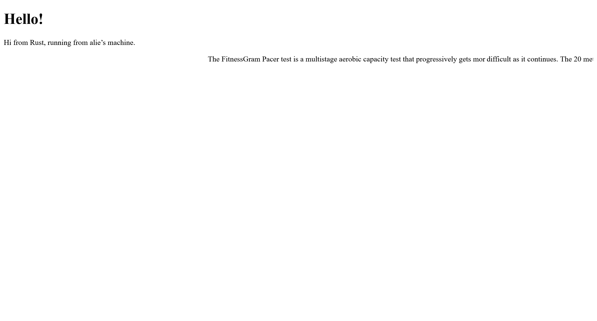

# advprog-rust

<html lang="en">
<details>
<summary>Commit 1 Reflection</summary>

1. You may need to check the Rust documentation to understand what is inside the handle_connection method. Write as reflection notes in the Readme.md. Write it nicely.

What is inside the handle_connection method?
I'll start from the function signature:

```rust
fn handle_connection(mut stream: TcpStream) {
```
handle_connection takes a variable `stream` with the type `TcpStream` as an argument, which is a connection to a client. The `mut` keyword means that handle_connection can modify `stream`.

```rust
let buf_reader = BufReader::new(&mut stream);
```
Binding the `BufReader::new(&mut stream)` value to the `buf_reader` variable. `BufReader::new(&mut stream)` creates a buffered reader around `stream`.
`BufReader` is used to help improve efficiency by reading data in chunks instead of reading byte by byte. `&mut stream` is referenced to ensure that `BufReader` can still read from `TcpStream`.

```rust
let http_request: Vec<_> = buf_reader
    .lines()
    .map(|result| result.unwrap())
    .take_while(|line| !line.is_empty())
    .collect();
```
`.lines()` returns an iterator over lines from the stream. 
`.map(|result| result.unwrap())`is used because each line read is wrapped in a `Result<String, Error>`, so `.unwrap()` is used to extract the `String`, assuming it is valid.
`.take_while(|line| !line.is_empty())` keeps reading lines until an empty line (`""`) is encountered. In an HTTP request, an empty line separates the headers from the body.
`.collect()` collects the processed lines into a `Vec<String>`.

In summary, it reads the HTTP request line by line, storing the request method, URL, and headers in a `Vec<String>` in the `http_request` variable. It stops reading when it encounters an empty line, which marks the end of the request headers.

Then, the last line:
```rust
println!("Request: {:#?}", http_request);
```
`println!` prints the collected HTTP request lines in an organized format (`{:#?}`). This helps in debugging by showing the full request received from the client.
</details>

<details>
<summary>Commit 2 Reflection</summary>
 

2. You may need to read more regarding some of text that your program should write to the browser such “Content-Length” and others, check the chapter 20 or other resources on that. Write your own reflection of what you have learned about the new code the handle_connection.

The new code no longer just reads the request and prints it—now it also sends an HTTP response. The function now reads an HTML file (`hello.html`) and sends its contents back as the response body.

The code for reading the request is the same as before:
```rust
fn handle_connection(mut stream: TcpStream) {
    let buf_reader = BufReader::new(&mut stream);
    let http_request: Vec<_> = buf_reader
        .lines()
        .map(|result| result.unwrap())
        .take_while(|line| !line.is_empty())
        .collect();
```

```rust
let status_line = "HTTP/1.1 200 OK";
```
Defines the HTTP status line, which tells the client that the request was successful (`200 OK`).

```rust
let contents = fs::read_to_string("hello.html").unwrap();
```
Reads the file `"hello.html"` from disk. `.unwrap()` assumes the file exists and will crash the program if it doesn't.

```rust
let length = contents.len();
```
Calculates the length of the file in bytes (needed for the `Content-Length` header).

```rust
let response =
    format!("{status_line}\r\nContent-Length:
{length}\r\n\r\n{contents}");
```
Constructs the full HTTP response:
  ```
  HTTP/1.1 200 OK
  Content-Length: <file size>
  
  <file contents>
  ```
`\r\n` (carriage return + newline) separates HTTP headers properly. The extra `\r\n\r\n` marks the end of the headers before sending the body.

```rust
stream.write_all(response.as_bytes()).unwrap();
```
Converts the response into bytes and writes it to the `stream`, sending it to the client. `.unwrap()` ensures the function panics if sending fails.
</details>
<details>
<summary>Commit 3 Reflection</summary>
 

3. You better do up to the refactoring one, and you need to explain in your reflection notes, how
to split between response and why the refactoring is needed. You also need to capture your
own screen shot, with your own message.

We can do splitting between responses by checking the request_line to see if it equals the request line of a GET request to the / path. If it does, the if block returns the contents of our `hello.html` file.
If the request_line does not equal the GET request to the / path, it means we’ve received some other request. 

Refactoring is needed because the initial if else clauses have a lot of repetition. They both read files and write the contents of the files to the stream. The only differences are the status line and the filename. The code can be more concise by pulling out those differences into separate if and else lines that will assign the values of the status line and the filename to variables; we can then use those variables unconditionally in the code to read the file and write the response.

This makes it easier to see the difference between the two cases, and it means we have only one place to update the code if we want to change how the file reading and response writing work. 
</details>
<details>
<summary>Commit 4 Reflection</summary>

4. Let’s open two of browser windows, try 127.0.0.1/sleep in one of them, and try in other windows 127.0.0.1. Pay attention that the browser take some time to load. You can imagine if many users try to access it. See how it works and try to understand why it works like that.

The first arm is the same as the if block from our previous code. The second arm matches a request to /sleep. When that request is received, the server will sleep for 5 seconds before rendering the successful HTML page. The third arm is the same as the else block from the previous code.

This reveals that our server is quite primitive, as real libraries would handle the recognition of multiple requests in a more elegant way.

If you enter the / URI a few times, as before, you’ll see it respond quickly. But if you enter /sleep and then load /, you’ll see that / waits until sleep has slept for its full 5 seconds before loading.

This happens because the server is blocking—it processes requests one at a time (or with limited concurrency).
</details>
</html>